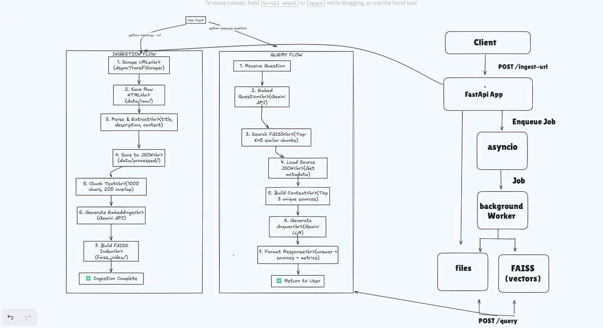

# TransFi RAG Q&A System

A production-ready Retrieval-Augmented Generation (RAG) system for TransFi's products and solutions documentation.


### Test it: Go to https://tfi-frontend.onrender.com/ and test it , this is the deployed version

#
## Installation

### Prerequisites
- Python 3.9+
- Google Gemini API key

### Step 1: Clone Repository
```bash
git clone https://github.com/abhi-gowdaa/tfi
cd tfi
```

### Step 2: Create Virtual Environment
```bash
python -m venv venv

# Windows
venv\Scripts\activate

# Linux/Mac
source venv/bin/activate
```

### Step 3: Install Dependencies
```bash
pip install -r requirements.txt
```

### Step 4: Configure Environment
Create a `.env` file in the project root:

```env
# Required
GOOGLE_API_KEY=your_gemini_api_key_here

 


##  Usage

### Part 1: CLI Scripts

#### 1. Data Ingestion
Scrape TransFi website and build FAISS index:

```bash
python ingest.py --url https://www.transfi.com
```

**Expected Output:**
```
============================================================
🚀 Starting TransFi RAG Ingestion Pipeline
============================================================

Phase 1: Scraping TransFi website...
 Discovering links from 4 navigation pages...
  Found 19 links from https://www.transfi.com
  Found 20 links from https://www.transfi.com/products
  ...

 Total unique pages to scrape: 20
   - Products: 9
   - Solutions: 8
   - Supported: 3
 Scraped [1] (product): https://www.transfi.com/products/bizpay (1.23s)
...

Saved 19 documents to data/processed/transfi_products.json

Phase 2: Chunking and Embedding...
Chunking 19 documents...
Created 183 chunks in 0.02s
Creating FAISS index with 183 documents...
FAISS index created and saved to faiss_index

============================================================
=== INGESTION METRICS ===
============================================================
Total Time: 245.3s
Pages Scraped: 19
Pages Failed: 0
Total Chunks Created: 183
Total Tokens Processed: 26,408
Embedding Generation Time: 180.5s
Indexing Time: 180.5s
Average Scraping Time per Page: 1.82s
No errors encountered!
============================================================
```

#### 2. Query Processing

**Single Question:**
```bash
python query.py --question "What is BizPay?"
```

**Output:**
```
Question: What is BizPay?
Answer: BizPay is a versatile solution built for businesses operating globally. It simplifies cross-border payments, enabling businesses to make payouts & payins across 100+ countries with the lowest processing fee, global compliance, and enterprise-grade security.
Sources:
  1. BizPay - https://www.transfi.com/products/bizpay
     Snippet: "BizPay is a versatile solution built for business operating globally..."
Metrics:
  Total Latency: 2.4s
  Retrieval Time: 0.3s
  LLM Time: 2.0s
  Post-processing Time: 0.1s
  Documents Retrieved: 5
  Documents Used in Answer: 1
  Input Tokens: 367
  Output Tokens: 158
  Estimated Cost: $0.0047
```

**Multiple Questions:**
```bash
# Create questions.txt
echo "What is BizPay?" > questions.txt
echo "What countries does TransFi support?" >> questions.txt
echo "What are the key features?" >> questions.txt

# Process sequentially
python query.py --questions questions.txt

# Process concurrently (faster)
python query.py --questions questions.txt --concurrent
```

### Part 2: FastAPI Service

#### Terminal 1: Start Webhook Receiver
```bash
python webhook_receiver.py --port 8001
```

#### Terminal 2: Start FastAPI Server
```bash
uvicorn api:app --port 8000 --reload
```

#### Terminal 3: Make API Requests

**1. Trigger Ingestion (Background)**
```bash
curl -X POST http://localhost:8000/api/ingest \
  -H "Content-Type: application/json" \
  -d '{
    "urls": ["https://www.transfi.com"],
    "callback_url": "http://localhost:8001/webhook"
  }'

# Response (immediate):
{"message": "Ingestion started"}

# Webhook callback (after completion):
{
  "metrics": {
    "status": "completed",
    "total_time": "245.3s",
    "pages_scraped": 19,
    "pages_failed": 0,
    "total_chunks_created": 183,
    "total_tokens_processed": 26408,
    "embedding_generation_time": "180.5s",
    "indexing_time": "180.5s"
  }
}
```

**2. Single Query**
```bash
curl -X POST http://localhost:8000/api/query \
  -H "Content-Type: application/json" \
  -d '{
    "question": "What is BizPay?",
    "k": 5
  }'

# Response:
{
  "answer": "BizPay is a versatile solution...",
  "sources": [...],
  "metrics": {
    "total_latency": 2.4,
    "retrieval_time": 0.3,
    "llm_time": 2.0,
    "documents_retrieved": 5,
    "input_tokens": 367,
    "output_tokens": 158,
    "estimated_cost": 0.0047
  }
}
```

**3. Batch Query (Concurrent)**
```bash
curl -X POST http://localhost:8000/api/query/batch \
  -H "Content-Type: application/json" \
  -d '{
    "questions": [
      "What is BizPay?",
      "What countries are supported?",
      "What are the key features?"
    ],
    "k": 5
  }'

# Response:
{
  "results": [
    {
      "question": "What is BizPay?",
      "answer": "...",
      "sources": [...],
      "metrics": {...}
    },
    ...
  ],
  "aggregate_metrics": {
    "total_questions": 3,
    "total_latency": "6.8s",
    "total_input_tokens": 1024,
    "total_output_tokens": 456,
    "total_cost": "$0.0125"
  }
}
```

**4. Health Check**
```bash
curl http://localhost:8000/ping

# Response:
{"status": "healthy", "service": "TransFi RAG API"}
```


### Test it: Go to http://127.0.0.1:8000/docs and try the APIs

### Or Postman use the React frontend [optional] :

clone the frontend folder
```bash
git clone https://github.com/abhi-gowdaa/tfi-frontend
```

```bash
cd into the folder
```

```bash
npm install
npm start
```

### Test it: Go to https://tfi-frontend.onrender.com/ and test it , this is the deployed version